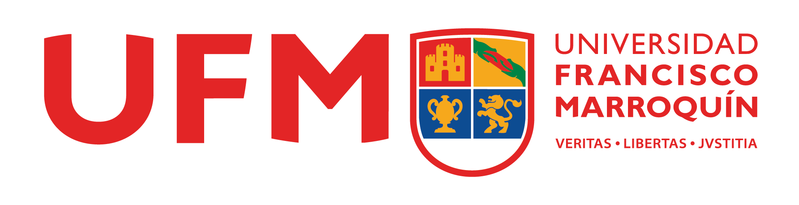

# Data Structures UFM - Guía

A continuación los links para los videos de funcionamiento, profiling y unit testing.

### Información preliminar 
Los directorios que contengan trabajos estarán precedidos por el character "#", en estos directorios estarán los trabajos.

Adicional en la carpeta "\_\_\_GeneralTestsJMeter&JUnit___" estarán los screenshots relevantes a cada trabajo en un directorio que sea concurrente con el título del trabajo y la fecha. 


## TRABAJO PARA EL LUNES 20 DE ENERO:
Link para el unit testing de Santa:
```
https://www.youtube.com/watch?v=DbSszDs4m_g
```

Link para el profiling de Santa:
```
https://www.youtube.com/watch?v=0vKDZ3m34Bw&t=23s
```

Link para el unit testing de SumN Natural Numbers: 
```
https://www.youtube.com/watch?v=f4zUc_GUjaU
```

Link para el profiling de SumN Natural Numbers: 
```
https://www.youtube.com/watch?v=S4GPn9J_Hf4
```


<!-- ### TRABAJO PARA EL LUNES 27 DE ENERO 2020: 
Link para la prueba de profiling y unit testing:
```
https://youtu.be/rPM4ujG45IE
```

Link para el funcionamiento en postman:
```
https://youtu.be/ft3dzUUM020 
``` -->

## TRABAJO PARA LUNES 03 DE FEBRERO 2020:
Link para trabajo de Array Stack, lo tuve que re hacer por que estaba usando ArrayLists.
```
https://youtu.be/FB6JKojE9LY
```

## TRABAJO PARA LUNES 09 DE FEBRERO DE 2020:
Link para trabajo de detección de palabras palíndromas en un string implementado usando arrays y strings.
```
https://youtu.be/yQTLBUp4Pio
```

## TRABAJO PARA LUNES 17 DE FEBRERO DE 2020:
Link para trabajo de detectar el cuadrante a partir de dos puntos dados:
```
https://youtu.be/hAfV2hZku8o
```

--------------------------------------------------------------------------



--------------------------------------------------------------------------

Estudiante: David Corzo
Carné: 20190432

